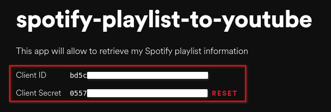

<h1 align="center">SpotOnTube</h1>

<h4 align="center" style="font-weight: bold;">A simple Python script that creates a YouTube playlist based on a Spotify playlist</h4>

<h2 align="center">Table of contents</h2>

- [About](#about)
  - [Read this before doing anything](#read-this-before-doing-anything)
- [Dependencies](#dependencies)
  - [List](#list)
  - [Installing](#installing)
- [Limitations](#limitations)
  - [YouTube API](#youtube-api)
  - [youtube_search library](#youtube-search-library)
- [Executing](#executing)
  - [Getting your credentials from Spotify](#getting-your-credentials-from-spotify)
  - [Getting your credentials from Google](#getting-your-credentials-from-google)
  - [Allowing apps to access and modify your accounts](#allowing-apps-to-access-and-modify-your-accounts)
  - [Executing (finally 😅)](#executing--finally--)
    - [On UNIX or GNU/Linux systems](#on-unix-or-gnulinux-systems)
    - [On Windows](#on-windows)
- [Building an .exe file](#building-an-exe-file)
- [Privacy](#privacy)
- [License](#license)

## About

SpotOnTube is a Python script that creates YouTube playlists based on your Spotify playlists. 

The script can also generate a `.json` file containing all songs from the selected Spotify playlist, if the user wants to see them.

### Read this before doing anything

I'm still testing this app to track some errors and bugs and I'm changing some things on the code constantly, such as messages and stuff. If you want to test it and give some feedback, I would much appreciate it!

## Dependencies

The script was made using Python 3.9.

My plan was to use the raw _Spotify Web API_ and _YouTube Data API_ but I couldn't set them properly. After some research, I came across two Python libraries. They are:  [spotipy](https://github.com/plamere/spotipy) and [youtube-search](https://github.com/joetats/youtube_search).

They helped me so much. They simplified some things and then I was able to give this project some light.

I want to thank all the people involved in those projects, for they brought these libraries to their existence. **You guys are awesome** 😎

For the YouTube's authorization, it's needed these dependencies:

- google-api-python-client
- google-auth-oauthlib

And, the .exe file for windows users was created using the [pyinstaller](https://github.com/pyinstaller/pyinstaller) library.

### List

- spotipy
- youtube-search
- google-api-python-client
- google-auth-oauthlib
- pyinstaller

### Installing

You'll need `pip` to install them. Make sure that you have it installed on your system.

On _UNIX or GNU/Linux_ systems, simply input on your terminal emulator:
```
$ pip install spotipy youtube-search google-api-python-client google-auth-oauthlib 
```

On _Windows_, if you want to execute the script via terminal, simply input on `cmd` or your terminal emulator:
```
C:\Users\<your username> pip install spotipy youtube-search google-api-python-client google-auth-oauthlib
```

## Limitations

### YouTube API

In the _YouTube API Daily Quota_ (you can see the cost for each request [here](https://developers.google.com/youtube/v3/determine_quota_cost?hl=en)), we have only **10,000 units**, in which we can do operations with. The cost of each YouTube search is **100 units**, but because the youtube_search library is being used, this isn't a problem.

The script does these operations:

- List a user's playlists: **50 units** (only called once)
- Create a playlist: **1 unit** (only called once and if the playlist doesn't exist)
- Insert videos into the playlist:  **50 units** (called per video that will be inserted). So, the maximum limit of videos it can insert per app is **199** (**198** if the playlist needs to be created). This will be, unfortunately, the limit of songs that the script will be able to do with per app or daily (as the quota resets every day at Pacific Time).

The script will automatically detect if there are videos that didn't get to be inserted, and will insert them if the user selects the same playlist, upon executing the program again (this, of course, if the user created another app, or executed the script again).

### [youtube_search](https://github.com/joetats/youtube_search) library

This library is a crawler, therefore not all results will be the same, depending where you live and which video is being search. Maybe some of them will not be the one you want, but the script does its best to find the match. And maybe a video will not be found, so it won't be added in the final playlist.

## Executing

Before executing, it's crucial to have the Spotify and YouTube's app credentials.

### Getting your credentials from Spotify

1. Go to the [Spotify Developers Dashboard](https://developer.spotify.com/dashboard/) and login into your Spotify account
2. Click on "Create an app"\
  \
  2.1. Input an app name, description and agree with their terms\
  \
  Example:\
  \
  Then click on "Create"
3. Click on "Edit settings"
  
  3.1. Under "Redirect URIs", input: `http://localhost:3000/callback/` then click on "Add"\
  \
  It should look like this:\
  \
  Finally, scroll down and click on "Save"
4. At the dashboard, click on "Show client secret"\
  \
  This will show both IDs:\
  \
  4.1. Copy both the client id and client secret and paste them in `spotifyCredentials.json` file, which is located in the folder `/credentials`. It looks like this:
    ```
    {
      "data": {
        "client_id": "<your client id>",
        "client_secret": "<your client secret>"
      }
    }
    ```
5. 🎉 *Voilá!* Your Spotfiy configuration is done!

### Getting your credentials from Google

1. Go to the [Google Cloud Platform Console](https://console.cloud.google.com/home/dashboard)
2. Accept the Google Cloud Platform terms\

3. Create a project\
  3.1. Click on "Select project" and then on "New project"\
  \
  \
  3.2. Give the project a name and click on "Create"\
  \
  Example:\
  
4. After the project was created, click on "Select project"\
  \
  4.1. On the dashboard, scroll down and click on "Explore and enable APIs"\
  
5. Create the OAuth consent screen\
  5.1. Click on "OAuth consent screen"\
  \
  5.2. Under "User type" select "External" and then click on "Create"\
  \
  5.3. Then, input an app name and your email\
  \
  5.4. Scroll down and under "Authorized domains" click on "Add domain" and add: `example.com`. Under "Developer contact information", input your email. Finally, click on "Save and continue"\
  \
  5.5. Click on "Add or remove scopes"\
  \
  5.6. Scroll down and under "Manually add scopes" and input: `https://www.googleapis.com/auth/youtube`. Click on "Add scope", then on "Update"\
  \
  5.7. Scroll down and click on "Save and continue"\
  5.8. Under "Test users", click on "Add users"\
  \
  5.9. Add your email, then click on "Add"\
  \
  5.10. Click on "Save and continue"
6. Click on "Library"\
  \
  6.1. Search for `youtube`, and click on "YouTube Data API v3"\
  
  6.2. Click on "Enable" and wait the operation to complete\
  
7. Click on "Create credentials"\
  
  7.1. Select what's on the image, and then click on "What credentials do I need?"\
  \
  7.2. Input a name, then click on "Create OAuth client ID"\
  \
  7.3. You can:
    - Or download your credentials and place the file on the `/credentials` folder and rename it as `youtubeCredentials.json`
    - Or copy its contents and paste them on the already existing file. 
    
    The file should look like this:
    ```
    {
      "installed": {
        "client_id": "<your client id>",
        "project_id": "<your project id>",
        "auth_uri": "https://accounts.google.com/o/oauth2/auth",
        "token_uri": "https://oauth2.googleapis.com/token",
        "auth_provider_x509_cert_url": "https://www.googleapis.com/oauth2/v1/certs",
        "client_secret": "<your client secret>"
        "redirect_uris": ["urn:ietf:wg:oauth:2.0:oob", "http://localhost"]
      }
    }
    ```
8. 🎉 *Voilá!* Your YouTube configuration is done! 

### Allowing apps to access and modify your accounts

Upon execution time, you'll be prompted to:
- Login into your Spotify account and allow the app to view and modify your account (this is done automatically: it opens your browser)
- Login into your Google account and allow the app to access and modify your YouTube account. You must:
  1. Open the link that the script will show you
  2. Select an account
  3. Click on "Continue", then "Allow":\
  \
  
  4. Check the box and click on "Allow":\
  
  5. Copy the generated code...\
  \
  ...and paste it on the terminal

### Executing (finally 😅)

1. Download the `zip` [here](https://github.com/Shobon03/spot-on-tube/archive/refs/tags/v1.0.zip) or clone this repo:
    ```
    git clone https://github.com/Shobon03/spot-on-tube
    ``` 
2. Make sure that you created the [Spotify](#getting-your-credentials-from-the-spotify-developers-dashboard) and [YouTube's](#getting-your-credentials-from-the-google-developers-dashboard) app and placed your credentials on their places.

#### On UNIX or GNU/Linux systems

3. Make sure that you have all [dependencies](#dependencies) installed.
4. Execute `spotOnTube.py` on your terminal and follow the steps there.
    ```
    $ pyhton3 spotOnTube.py
    ```

#### On Windows

3. Execute `spotOnTube.exe` and follow the steps there.

## Building an .exe file

The `pyinstaller` library is used to generate the .exe file.
Using `pip`, install it:
```
C:\<root of the project> pip install pyinstaller
```

After installing, build the .py file on `cmd` or your terminal emulator (please note that this can take a while):
```
C:\<root of the project> pyinstaller --onefile <filename>.py
```

On the folder `dist`, you'll have your newly created .exe file. Put it on the root folder of the project. You can also delete the `<filename>.spec` file and both the `dist` and `build` folders.

## Privacy

The SpotOnTube script ***doesn't*** collect your personal data.

SpotOnTube only accesses your Spotify data to **see your playlists** and **list their tracks** and to modify your YouTube account, but just to **create a playlist** and **insert videos into it**.

## License

\
SpotOnTube is released under the [GPL-3.0](./LICENSE) license.
```
Copyright (C) 2021 Shobon03

This program is free software: you can redistribute it and/or modify it 
under the terms of the GNU General Public License as published by the 
Free Software Foundation, either version 3 of the License, or (at 
your option) any later version.

This program is distributed in the hope that it will be useful, but WITHOUT 
ANY WARRANTY; without even the implied warranty of MERCHANTABILITY or FITNESS 
FOR A PARTICULAR PURPOSE. See the GNU General Public License for more details.

You should have received a copy of the GNU General Public License along with 
this program. If not, see <https://www.gnu.org/licenses/>.
```