# Executing spot-on-tube

## Getting things ready

**_Before executing, it's crucial to have the Spotify and Google's apps credentials._**

### Getting your credentials from Spotify

1. Go to the [Spotify Developers Dashboard](https://developer.spotify.com/dashboard/) and login into your Spotify account
2. Click on "Create an app"\
   \
   2.1. Input an app name, description and agree with their terms\
   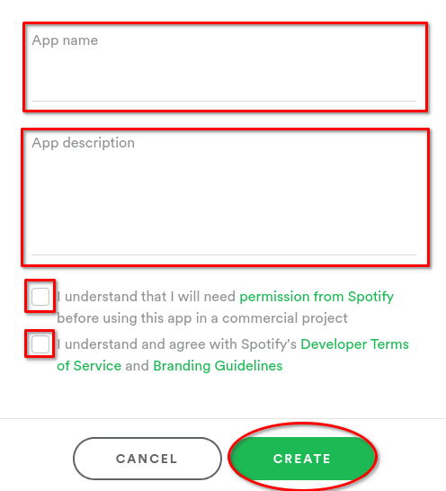\
   Example:\
   \
   Then click on "Create"
3. Click on "Edit settings"
   
   3.1. Under "Redirect URIs", input: `http://localhost:3000/callback/` then click on "Add"\
   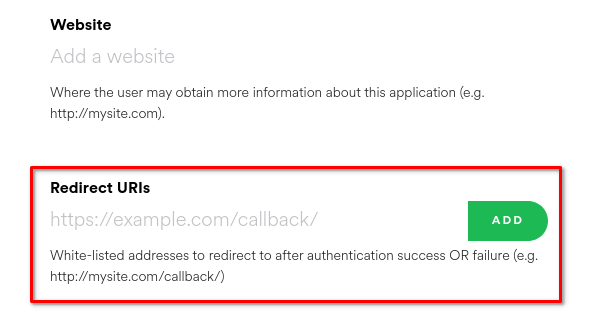\
   It should look like this:\
   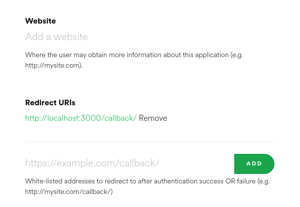\
   Finally, scroll down and click on "Save"
4. At the dashboard, click on "Show client secret"\
   \
   This will show both IDs:\
   \
   4.1. Copy both the client id and client secret and paste them in `spotifyCredentials.json` file, which is located in the folder `credentials`. It looks like this:
   ```
   {
     "data": {
       "client_id": "<your client id>",
       "client_secret": "<your client secret>"
     }
   }
   ```
5. 🎉 _Voilá!_ Your Spotfiy configuration is done!

### Getting your credentials from Google

1. Go to the [Google Cloud Platform Console](https://console.cloud.google.com/home/dashboard)
2. Accept the Google Cloud Platform terms\
   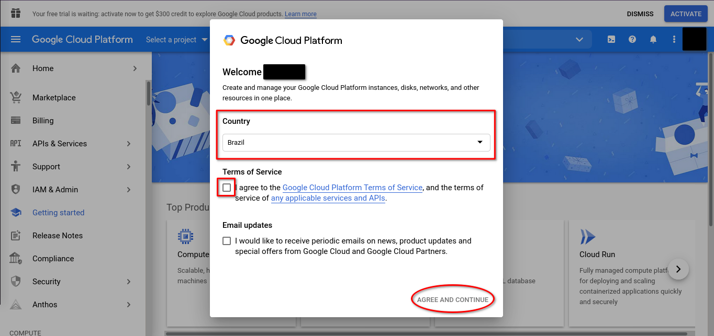
3. Create a project\
   3.1. Click on "Select project" and then on "New project"\
   \
   \
   3.2. Give the project a name and click on "Create"\
   \
   Example:\
   
4. After the project was created, click on "Select project"\
   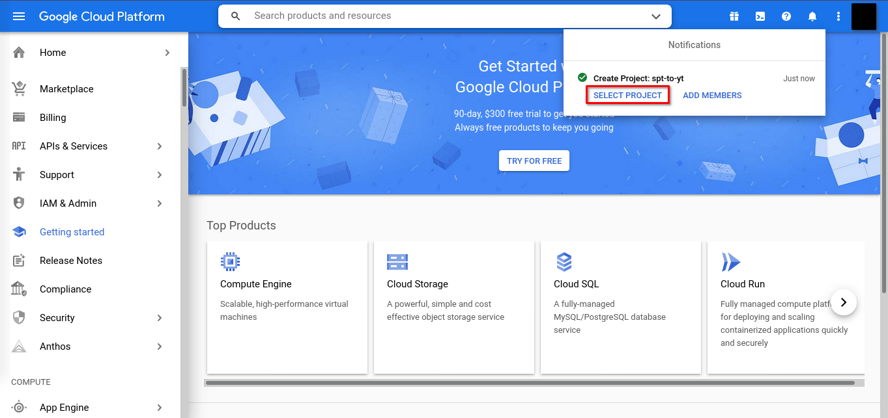\
   4.1. On the dashboard, scroll down and click on "Explore and enable APIs"\
   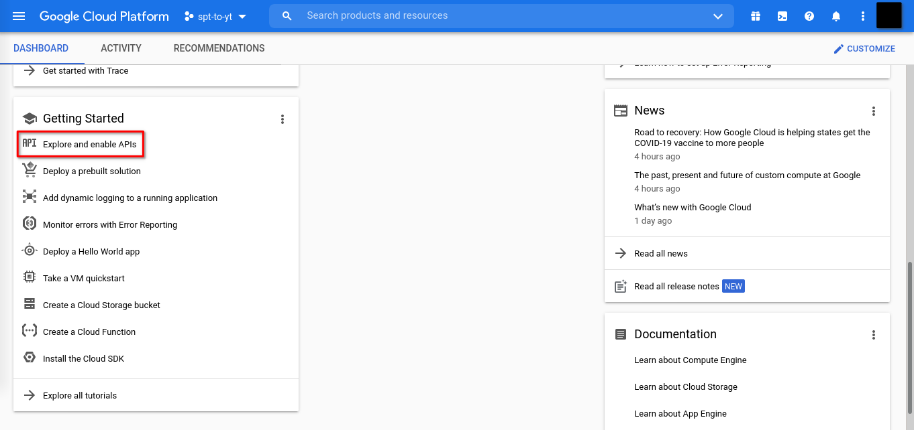
5. Create the OAuth consent screen\
   5.1. Click on "OAuth consent screen"\
   \
   5.2. Under "User type" select "External" and then click on "Create"\
   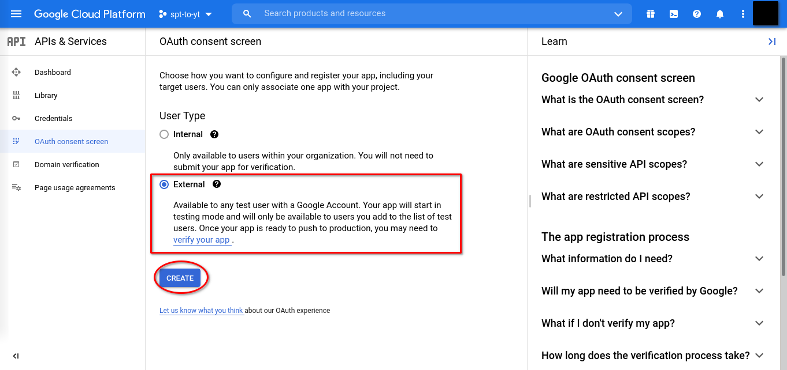\
   5.3. Then, input an app name and your email\
   \
   5.4. Scroll down and under "Authorized domains" click on "Add domain" and add: `example.com`. Under "Developer contact information", input your email. Finally, click on "Save and continue"\
   \
   5.5. Click on "Add or remove scopes"\
   \
   5.6. Scroll down and under "Manually add scopes" and input: `https://www.googleapis.com/auth/youtube`. Click on "Add scope", then on "Update"\
   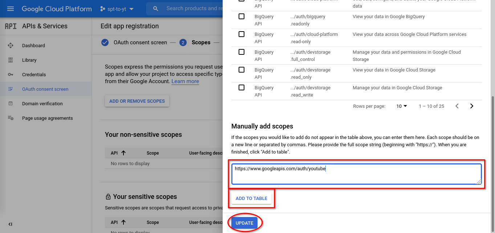\
   5.7. Scroll down and click on "Save and continue"\
   5.8. Under "Test users", click on "Add users"\
   \
   5.9. Add your email, then click on "Add"\
   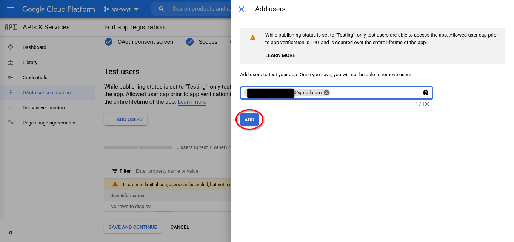\
   5.10. Click on "Save and continue"
6. Click on "Library"\
   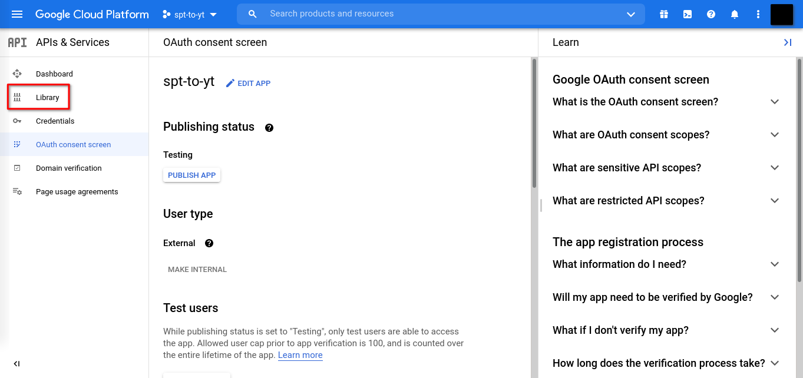\
   6.1. Search for `youtube`, and click on "YouTube Data API v3"\
   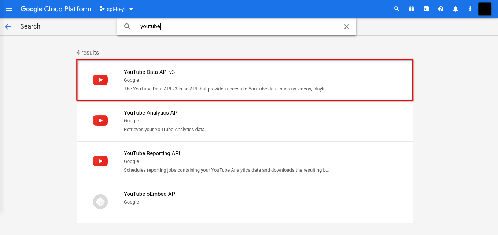
   6.2. Click on "Enable" and wait the operation to complete\
   
7. Click on "Create credentials"\
   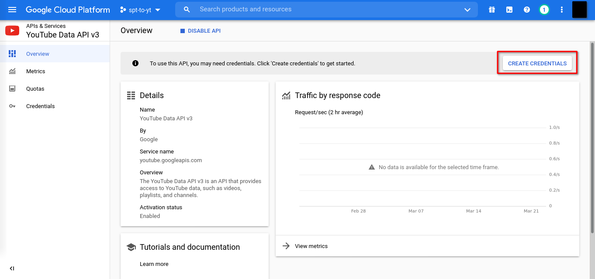
   7.1. Select what's on the image, and then click on "What credentials do I need?"\
   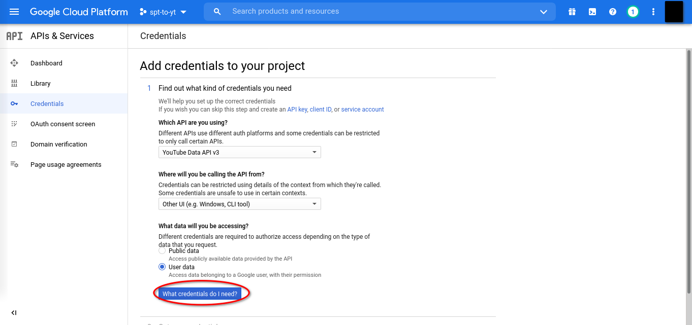\
   7.2. Input a name, then click on "Create OAuth client ID"\
   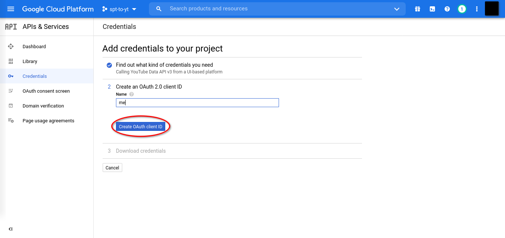\
   7.3. You can:
   - Or download your credentials and place the file on the `credentials` folder and rename it as `youtubeCredentials.json`
   - Or copy its contents and paste them on the already existing file.
     The file should look like this:
   ```
   {
     "installed": {
       "client_id": "<your client id>",
       "project_id": "<your project id>",
       "auth_uri": "https://accounts.google.com/o/oauth2/auth",
       "token_uri": "https://oauth2.googleapis.com/token",
       "auth_provider_x509_cert_url": "https://www.googleapis.com/oauth2/v1/certs",
       "client_secret": "<your client secret>"
       "redirect_uris": ["urn:ietf:wg:oauth:2.0:oob", "http://localhost"]
     }
   }
   ```
8. 🎉 _Voilá!_ Your YouTube configuration is done!

### Allowing apps to access and modify your accounts

Upon execution time, you'll be prompted to:

- Login into your Spotify account and allow the app to view and modify your account (this is done automatically: it opens your browser)
- Login into your Google account and allow the app to access and modify your YouTube account. You must:
  1. Open the link that the script will show you
  2. Select an account
  3. Click on "Continue", then "Allow":\
     \
     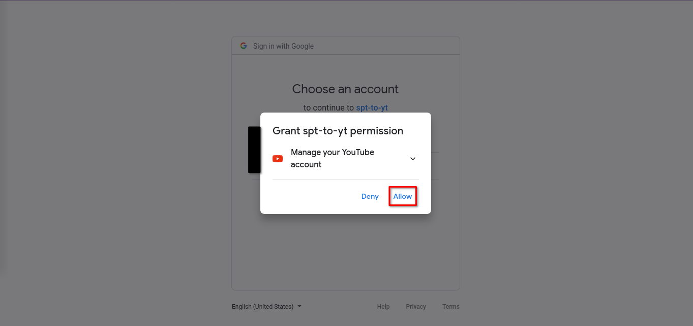
  4. Check the box and click on "Allow":\
     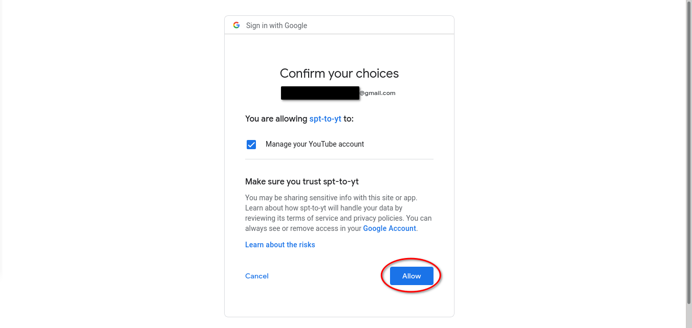
  5. Copy the generated code...\
     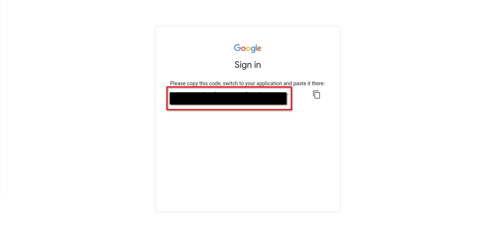\
     ...and paste it on the terminal

## And now... executing for real (finally 😅)

1. Download or clone this repo:
   ```
   git clone https://codeberg.org/Shobon03/spot-on-tube
   ```
2. **_Make sure that you created the [Spotify](#getting-your-credentials-from-the-spotify-developers-dashboard) and [YouTube's](#getting-your-credentials-from-the-google-developers-dashboard) app and placed your credentials on their places._**

#### Script

`From the command line`

3. Make sure that you have all [dependencies](#dependencies) installed.
4. Execute `spot-on-tube.py` on your terminal and follow the steps there.
   ```
   pyhton3 spot-on-tube.py
   ```

#### .exe file

`Windows only`

3. Execute `spot-on-tube.exe` and follow the steps there.

Still in development. Soon, the .exe file will be avaliable.

_Update 06-2024: The .exe file is already on the project's root folder._

## Building an .exe file

The `pyinstaller` library is used to generate the .exe file.

Using `pip`:

```
pip install pyinstaller
```

After installing, build the `.py` file (please note that this can take a while...)

[Replace `<filename>.py` with `spot-on-tube.py` or the name you have written]

```
pyinstaller --onefile <filename>.py --icon="images/logos/logo.ico"
```

On the folder `dist`, you'll have your newly created .exe file. Put it on the root folder of the project. You can also delete the `<filename>.spec` file and both the `dist` and `build` folders.
